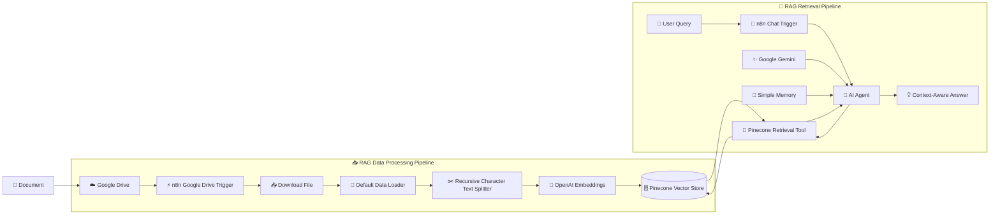

# 🤖 RAG AI Chatbot with n8n, ,OpenAI ,Gemini & Pinecone

    > An AI-powered Retrieval-Augmented Generation (RAG) chatbot built with n8n, Google Gemini, OpenAI Embeddings, and Pinecone — 
    designed to retrieve relevant information from uploaded documents and generate context-aware answers.**

---

## 🚀 Overview

This project implements a **Retrieval-Augmented Generation (RAG)** pipeline using **n8n** as the workflow orchestration layer.

    Instead of relying only on an LLM's pre-trained knowledge, the chatbot retrieves relevant information from a custom knowledge base stored in Pinecone and uses that context to generate more relevant     responses.

    The system is divided into two independent workflows:

    * 📥 Data Processing & Indexing Pipeline
    * 💬 Retrieval & AI Chat Pipeline

    This architecture separates knowledge ingestion from question answering, making the system easier to maintain and extend.

---

## ✨ Key Features

    * 📂 Automatic document ingestion from Google Drive
    * ✂️ Recursive document chunking
    * 🧩 Configurable chunk size and overlap
    * 🧠 OpenAI embeddings for semantic representation
    * 🗄️ Pinecone vector database for storing and retrieving knowledge
    * 🤖 Google Gemini-powered AI Agent
    * 🔎 Semantic retrieval through Pinecone
    * 🧠 Conversation memory using n8n Simple Memory
    * 💬 Natural-language chat interface
    * ⚡ Fully orchestrated using n8n workflows
    * 🔄 Separate ingestion and retrieval pipelines

---

## 🏗️ System Architecture



---

# 🔄 How the RAG Pipeline Works

## 1️⃣ Document Ingestion

    The first workflow is responsible for preparing documents and storing their semantic representations in Pinecone.

### Workflow

```text
    Google Drive
         ↓
    File Created Trigger
         ↓
    Download File
         ↓
    Default Data Loader
         ↓
    Recursive Character Text Splitter
         ↓
    OpenAI Embeddings
         ↓
    Pinecone Vector Store
```

    The workflow watches a specific Google Drive folder for newly created files. The document is then passed through the n8n LangChain document-processing components before being inserted into the Pinecone     vector database.

### 🧩 Document Chunking

    The project uses the Recursive Character Text Splitter with:
    
    | Parameter     | Value |
    | ------------- | ----: |
    | Chunk Size    | `500` |
    | Chunk Overlap | `200` |
    

### 🧠 Embedding Generation

    Each processed document chunk is converted into a vector representation using OpenAI Embeddings.
    
    These vectors are then stored in the Pinecone index:
    
```text
    ritesh-first-rag
```

    The document loader also attaches the source file name as metadata, allowing the stored information to retain its document context.

---

# 💬 2️⃣ Retrieval & Chat Pipeline

    The second workflow handles user questions.

### Workflow

```text
    👤 User
      ↓
    💬 Chat Trigger
      ↓
    🤖 AI Agent
      ├── ✨ Google Gemini
      ├── 🧠 Simple Memory
      └── 🔎 Pinecone Vector Search
              ↓
          Relevant Context
              ↓
          🤖 AI Agent
              ↓
          💡 Final Answer
```
    
    The chatbot starts when a user sends a message through the n8n chat trigger.
    
    The query is passed to an AI Agent, which has three important components:
    
    ### ✨ Google Gemini
    
    Google Gemini acts as the language model responsible for understanding the user's question and generating the final response.
    
    ### 🔎 Pinecone Retrieval
    
    Pinecone is connected to the AI Agent as a retrieval tool.
    
    When the agent requires information from the knowledge base, it can retrieve relevant information from the `ritesh-first-rag` vector index.
    
    ### 🧠 Conversation Memory
    
    The workflow also includes **n8n Simple Memory**, allowing the agent to maintain conversational context across interactions within the configured memory window.
    
---

# 🧠 RAG Architecture

    The core idea behind the system is:
    
```text
                 KNOWLEDGE BASE
                      │
                      ▼
              ┌─────────────────┐
              │   Documents     │
              └────────┬────────┘
                       │
                       ▼
              ┌─────────────────┐
              │  Text Chunking  │
              └────────┬────────┘
                       │
                       ▼
              ┌─────────────────┐
              │ OpenAI Embedding│
              └────────┬────────┘
                       │
                       ▼
              ┌─────────────────┐
              │    Pinecone     │
              │ Vector Database │
              └────────┬────────┘
                       │
                       │ Retrieval
                       ▼
    👤 Question ──► 🤖 AI Agent ◄── ✨ Gemini
                       │
                       ▲
                       │
                  🧠 Memory
                       │
                       ▼
                 💡 Final Answer
```

---

# 🛠️ Tech Stack
    
    | Technology               | Purpose                              |
    | ------------------------ | ------------------------------------ |
    | ⚡ **n8n**                | Workflow automation & orchestration  |
    | 🤖 **Google Gemini**     | LLM / response generation            |
    | 🧠 **OpenAI Embeddings** | Text vectorization                   |
    | 🗄️ **Pinecone**         | Vector database & semantic retrieval |
    | ☁️ **Google Drive**      | Document source                      |
    | 🔗 **LangChain nodes**   | Document processing & RAG components |

---

# 📂 Project Structure
    
```text
    RAG-AI-Chatbot/
    │
    ├── 📥 Pre-Data-Processing/
    │   └── Pre- Data Processing(RAG) pt 1.json
    │
    ├── 💬 Retrieval-Unit/
    │   └── retrival unit for RAG pt2.json
    │
    └── 📖 README.md
```
    
---

# ⚙️ Workflow 1 — Data Processing

    Purpose: Convert uploaded documents into searchable vector representations.

### Nodes
    
```text
    Google Drive Trigger
            ↓
    Download File
            ↓
    Pinecone Vector Store
            ↑
            ├── OpenAI Embeddings
            │
            └── Default Data Loader
                    ↑
                    │
            Recursive Character
              Text Splitter
```
    
    The Pinecone vector store receives the processed documents, while the embedding model and document loader are connected through n8n's AI-specific connections.

---

# ⚡ Workflow 2 — Retrieval Agent
    
    **Purpose:** Accept user questions, retrieve relevant knowledge, and generate an answer.
    
    ### Nodes
    
```text
    When Chat Message Received
                 ↓
             AI Agent
            ↙    ↓    ↘
       Gemini  Memory  Pinecone
                        ↑
                  OpenAI Embeddings
```
    
    The AI Agent connects to Gemini as its language model, Simple Memory for conversational context, and Pinecone as a retrieval tool.
    
---

# 🔐 Credentials & Configuration
    
    Before importing and running the workflows, configure the required credentials in n8n:
    
    * Google Drive OAuth2
    * OpenAI API
    * Pinecone API
    * Google Gemini API
    
    # ▶️ Running the Project
    
    ### 1. Start n8n
    
    Run your n8n instance locally or use an n8n-hosted environment.
    
    ### 2. Configure Credentials
    
    Add:
    
```text
    Google Drive
    OpenAI
    Pinecone
    Google Gemini
 ```
    
    ### 3. Create / Configure Pinecone Index
    
    Use the Pinecone index configured for the workflow:
    
```text
    ritesh-first-rag
```
    
    ### 4. Import the Workflows
    
    Import both JSON workflow files into n8n:
    
```text
    Pre- Data Processing(RAG) pt 1.json
    retrival unit for RAG pt2.json
```
    
    ### 5. Add Documents
    
    Place the documents you want the chatbot to understand into the configured Google Drive folder.
    
    ### 6. Run the Ingestion Workflow
    
    The ingestion workflow processes the document and stores its embeddings in Pinecone.
    
    ### 7. Start the Chat Workflow
    
    Send a question through the n8n chat interface.
    
    The AI Agent can then retrieve relevant information from the Pinecone knowledge base and use Gemini to generate the response.
    
---

# 📊 RAG Pipeline at a Glance

    | Stage         | Component          | Role                          |
    | ------------- | ------------------ | ----------------------------- |
    | 📂 Source     | Google Drive       | Store documents               |
    | 📥 Ingestion  | n8n                | Detect & process documents    |
    | ✂️ Processing | Recursive Splitter | Split documents               |
    | 🧠 Embedding  | OpenAI             | Generate vectors              |
    | 🗄️ Storage   | Pinecone           | Store & retrieve vectors      |
    | 💬 Input      | n8n Chat Trigger   | Receive questions             |
    | 🤖 Agent      | n8n AI Agent       | Orchestrate retrieval         |
    | ✨ LLM         | Google Gemini      | Generate responses            |
    | 🧠 Memory     | Simple Memory      | Maintain conversation context |

---

# 🎯 Why RAG?

    Traditional LLM applications depend primarily on the model's existing knowledge.
    
    This project uses **Retrieval-Augmented Generation** to connect an LLM with an external knowledge base.
    
```text
    Traditional LLM
    
    Question
       ↓
    LLM
       ↓
    Answer
```
    
    Compared with:
    
```text
    RAG
    
    Question
       ↓
    Retrieve Relevant Knowledge
       ↓
    LLM + Retrieved Context
       ↓
    Answer
```
    
    This makes it possible to build AI assistants around **custom documents and domain-specific information** without requiring the entire knowledge base to be part of the model's training data.

---

# 🌟 Highlights
    
    * 🔄 End-to-end RAG workflow automation
    * 🧩 Modular ingestion and retrieval architecture
    * 🧠 Semantic search using vector embeddings
    * ⚡ n8n-based low-code AI orchestration
    * 🤖 Agent-based retrieval with Gemini
    * 🗄️ Pinecone vector database integration
    * 💬 Conversational memory
    * 📚 Custom document knowledge base

---

# 🚧 Future Improvements
    
    Potential improvements for future versions:
    
    * 📌 Add source citations to generated answers
    * 📄 Support multiple document formats
    * 🔍 Add metadata-based filtering
    * 🧠 Improve retrieval and ranking
    * 📊 Add monitoring and evaluation
    * 🔐 Add authentication for the chatbot
    * 🌐 Deploy the chatbot as a web application
    * 📝 Add response guardrails
    * 📈 Track retrieval quality and LLM performance

---

# 👨‍💻 Author

    Ritesh Kumar Sahoo

---

## ⭐ If you found this project interesting

    Feel free to explore the workflows, experiment with different documents, and extend the RAG pipeline with additional retrieval, evaluation, and agent capabilities.
